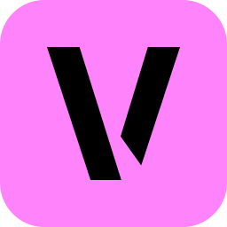
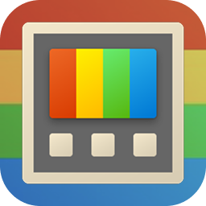
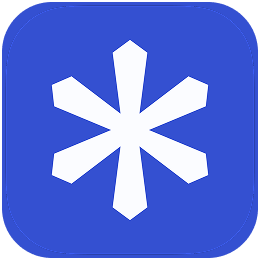
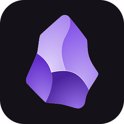

<!-- I don't like GitHub markdown very much -->
<!-- 

Credit: <a href="https://x.com/tyc001x/status/1815361315348812080">@tyc001x</a>

 -->

  

<h3>
  Welcome to my profile page
  
</h3>

I'm a computer engineer based in Nigeria that loves video games, illustration, design, web-dev and FOSS. Appriciates simplicity and efficient ways to solve problems. Currently taking foundations courses from [TOP](https://github.com/theodinproject). Thanks for visiting! ❁ _Image credit: [@tyc001x](https://x.com/tyc001x/status/1815361315348812080)_

 

### Languages and tools

 

### Some of my favourite FOSS projects

<table align="center">
<tr>
<td align="center" width="33%"> <!--THING 1 VERT-->
  

&emsp; &emsp; &emsp; &emsp; &emsp; &emsp;

[VERT](https://vert.sh)

</td>
<td align="center" width="33%"> <!--THING 2 FLUENTFLYOUT-->
  

&emsp; &emsp; &emsp; &emsp; &emsp; &emsp;

[FluentFlyout](https://github.com/unchihugo/FluentFlyout)

</td>
<td align="center" width="33%"> <!--THING 3 POWERTOYS-->
  

&emsp; &emsp; &emsp; &emsp; &emsp; &emsp;

[PowerToys](https://github.com/microsoft/powertoys)

</td>
</tr>
<!-- ROW 2 -->
<tr>
<td align="center" width="33%"> <!--THING 4 HELIUM-->
  

&emsp; &emsp; &emsp; &emsp; &emsp; &emsp;

[Helium](https://helium.computer)

</td>
<td align="center" width="33%"> <!--THING 5 OBSIDIAN-->
  

&emsp; &emsp; &emsp; &emsp; &emsp; &emsp;

[Obsidian](https://obsidian.md/)*

</td>
<td align="center" width="33%"> <!--THING 6 CASHEW-->
  

&emsp; &emsp; &emsp; &emsp; &emsp; &emsp;

[Cashew](https://github.com/jameskokoska/Cashew)

</td>
</tr>
</table>
